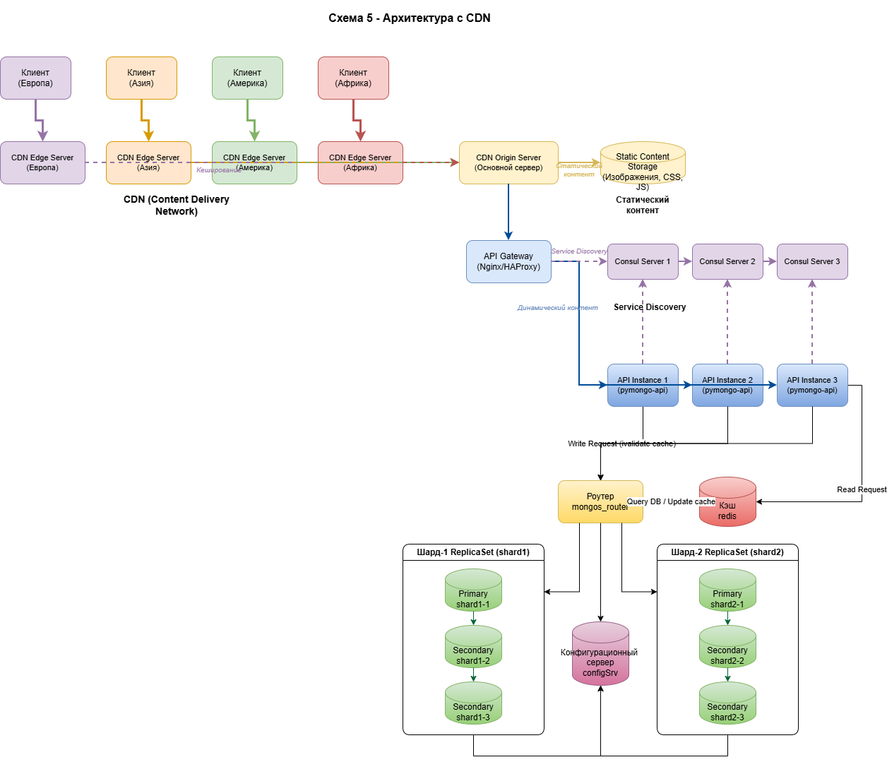

# Сдача проектной работы 4 спринта

## Задание 1. Планирование

1. [Первый вариант шардирование](schemas/schema-v1-sharding.drawio)
2. [Второй вариант плюс репликация](schemas/schema-v2-replication.drawio)
3. [Третий вариант плюс кэширование](schemas/schema-v3-caching.drawio)

## Задание 2. Шардирование

[Инструкция по запуску второго задания](mongo-sharding/README.md)

## Задание 3. Репликация

[Инструкция по запуску третьего задания](mongo-sharding-repl/README.md)

## Задание 4. Кеширование

[Инструкция по запуску четвертого задания](sharding-repl-cache/README.md)

## Задание 5. Service Discovery и балансировка с API Gateway

[Четверый вариант схемы плюс масштабирование сайта](schemas/schema-v4-scaling.drawio)

## Задание 6. CDN

[Пятый вариант схемы плюс сервис CDN](schemas/schema-v5-cdn.drawio)

### Финальная схема

