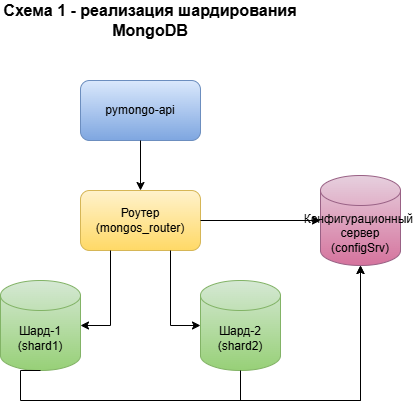

# Задание 2. Шардирование

## Схема решения



## Как запустить

Решение находится в папке mongo-sharding.  
Из этой папки нужно запустить скрипт:  
```shell
chmod +x ./scripts/start-mongo.sh
./scripts/start-mongo.sh
```
Скрипт удаляет возможные остатки от предыдущих запусков, создает и запускает контейнеры и наполняет базу тестовыми данными.  
Конфигурация compose.yaml уже содержит необходимые "сервисы" для инициализации сервиса конфигурации шардов, 
инициализации шардов, добавления шардов в MongoDB роутер, создания коллекции и включения шардирования.
После запуска всех служб скрипт добавляет в базу тестовые данные.


## Как проверить

```shell
chmod +x ./scripts/count-docs.sh
./scripts/count-docs.sh
```
Скрипт выдает количество документов в shard1, shard2 и общее количество документов в обоих шардах.

