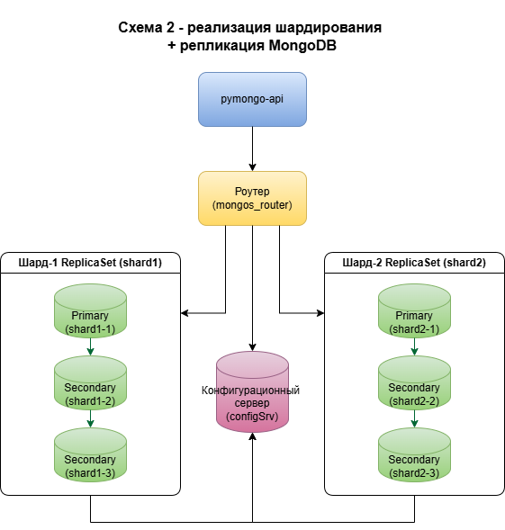

## Задание 4. Кеширование


## Схема решения



## Как запустить

Решение находится в папке sharding-repl-cache.  
Из этой папки нужно запустить скрипт:  
```shell
./scripts/start-mongo.sh
```
Скрипт удаляет возможные остатки от предыдущих запусков, создает и запускает контейнеры и наполняет базу тестовыми данными.  
Конфигурация compose.yaml уже содержит необходимые "сервисы" для инициализации сервиса конфигурации шардов, 
инициализации шардов с учетом трех реплик, добавления шардов в MongoDB роутер, создания коллекции и включения шардирования.
Дополнительно к предыдущим заданиям сконфигурирован сервис redis для кэширования.
После запуска всех служб скрипт добавляет в базу тестовые данные.


## Как проверить

```shell
./scripts/count-docs.sh
```
Скрипт выдает общее количество документов в обоих шардах и распределение по шардам.  
Затем выполняется два GET запроса подряд к эндпоинту /helloDoc/users  
для оценки времени запроса данных через БД и через кэш.
